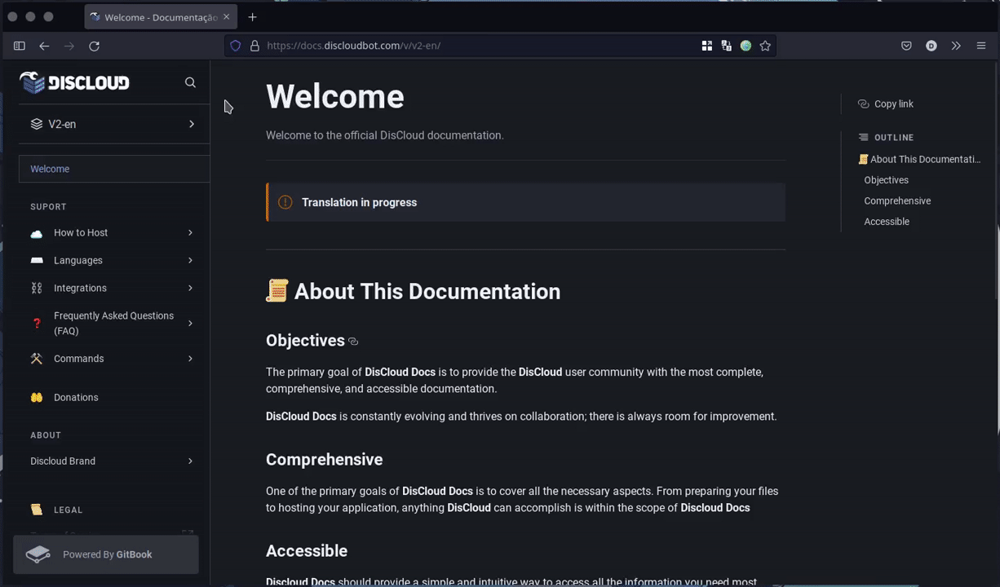

# Bem-Vindo

## 📜 Sobre Esta Documentação

### Objetivos

O objetivo primário da **DisCloud Docs** é fornecer à comunidade de usuários da **DisCloud** a documentação mais completa, compreensiva e acessível.

**DisCloud Docs** está constantemente evoluindo e prospera com a colaboração; há sempre espaço para melhoria.

### Compreensivo

Um dos objetivos primários da **DisCloud Docs** é cobrir todos os aspectros necessários. Da preparação dos seus arquivos à hospedagem da sua aplicação, qualquer coisa que a **DisCloud** possa alcançar está dentro do escopo da **Discloud Docs**

### Acessível

**Discloud Docs** deve oferecer uma forma simples e intuitiva de acessar todas as informações que mais necessita.

> •  **`Tech Support:`** [Ticket](suporte/faq/ticket.md), support@discloudbot.com\
> •  **`Trust & Safety:`** [Ticket](suporte/faq/ticket.md), abuse@discloudbot.com                                                                                   \
> •  **`Twitter:`** [**https://twitter.com/discloudbot**](https://twitter.com/discloudbot)\
> •  **`YouTube:`** [**https://youtube.com/c/pedroricardor**](https://youtube.com/c/pedroricardor)\
> •  **`Discord:`** [**https://discord.gg/CvxevT5**](https://discord.gg/CvxevT5)
