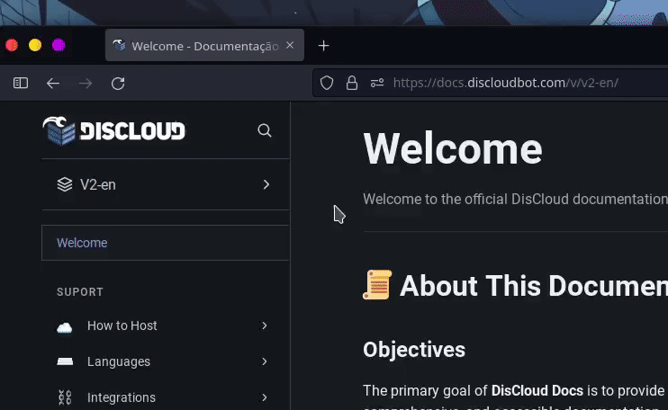

# Welcome

## 📜 About This Documentation

### Objectives

The primary goal of **DisCloud Docs** is to provide the **DisCloud** user community with the most complete, comprehensive, and accessible documentation.

**DisCloud Docs** is constantly evolving and thrives on collaboration; there is always room for improvement.

### Comprehensive

One of the primary goals of **DisCloud Docs** is to cover all the necessary aspects. From preparing your files to hosting your application, anything **DisCloud** can accomplish is within the scope of **Discloud Docs**

### Accessible

**Discloud Docs** should provide a simple and intuitive way to access all the information you need most.

> •  **`Tech Support:`** [Ticket](suport/faq/ticket.md), support@discloudbot.com\
> •  **`Trust & Safety:`** [Ticket](suport/faq/ticket.md), abuse@discloudbot.com\
> •  **`Instagram:`** [**https://www.instagram.com/discloudbot/**](https://www.instagram.com/discloudbot/)****\
> ****•  **`Github:`** [**https://github.com/discloud**](https://github.com/discloud)                                                                           \
> •  **`Twitter:`** [**https://twitter.com/discloudbot**](https://twitter.com/discloudbot)\
> •  **`YouTube:`** [**https://youtube.com/c/pedroricardor**](https://youtube.com/c/pedroricardor)\
> •  **`Discord:`** [**https://discord.gg/CvxevT5**](https://discord.gg/CvxevT5)
