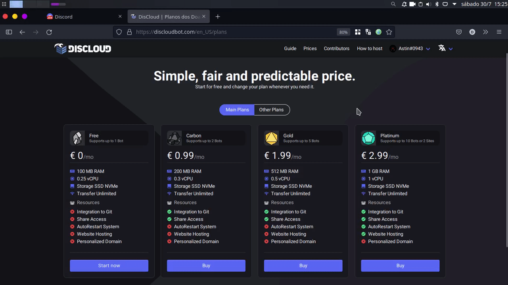

# 🤲 Donations

### :dollar: Payment Methods

<table><thead><tr><th>Payment Method</th><th data-type="checkbox">Available via Website</th><th data-type="checkbox">Available via Ticket</th></tr></thead><tbody><tr><td> PayPal</td><td>true</td><td>true</td></tr></tbody></table>

###  Buy via WebSite

Go to [discloudbot.com/plans](https://discloudbot.com/plans) and choose your plan.

###  Buy via Ticket


If your desired payment method is available [via the website](donations.md#comprar-via-site) use only **Ticket** if you are experiencing **payment problems** or when the website is **unavailable**.


See below for more details:


[ticket.md](suport/faq/ticket.md)


### :arrows\_counterclockwise: Renew a plan

If your desired [payment method](donations.md#payment-methods) is available through our site, we recommend that you renew your plan through it, so the renewal process becomes faster!
