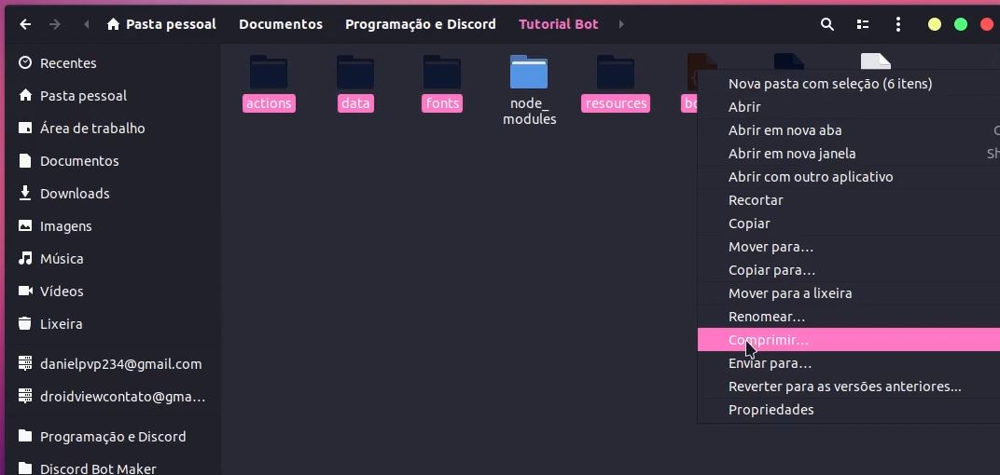

# Como compactar \(zipar\) os meus arquivos?

## Windows

Selecione os arquivos necessários \(dito nos tutoriais\), aperte com botão direito sobre eles, arraste o mouse para **Enviar para** e clique em **Pasta compactada**.





## Linux

Selecione os arquivos necessários \(dito nos tutoriais\), aperte com botão direito sobre eles, clique em Comprimir e selecione `.zip`.

