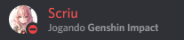

# Como pegar o ID do meu Bot?

## 💁 Pelo Discord

É bem simples, ative o modo desenvolvedor no seu Discord indo em `Configurações >> Aparência >> Avançado` e ative o **Modo desenvolvedor**.

Aperte com o botão direito em cima do nome do seu bot e na última opção aparecerá o botão **Copiar ID**.

## 💁 Pelo site

Você também pode pegar o ID do seu bot indo em [Discord Developer Portal](https://discordapp.com/developers/applications/). Clique sobre a sua aplicação e em **Client ID**, clique em **Copy**.

