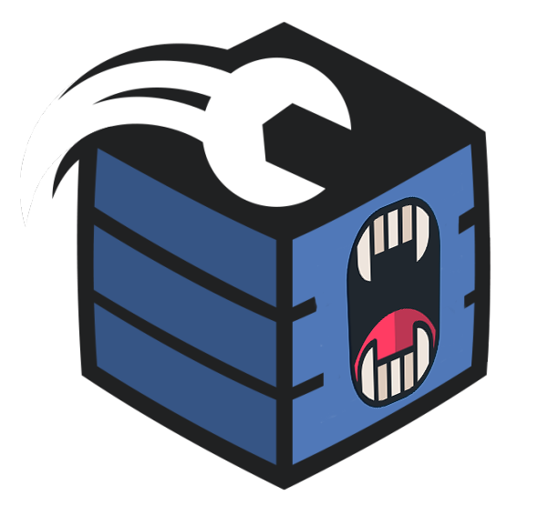

# Identidade Visual


**Em geral, não use o nome ou logotipos da DisCloud de maneiras que possam ser confusas, enganosas ou sugerir nosso patrocínio, endosso ou afiliação.**


## Logo















## Icon















## Fonte



A fonte usada para o logotipo da DisCloud é uma versão modificada do [Uni Sans Heavy](https://www.myfonts.com/fonts/font-fabric/uni-sans/), que foi projetada por Svet Simov em 2009.










**Não edite, altere, distorça, mude a cor ou reconfigure o logotipo do Discord.**


