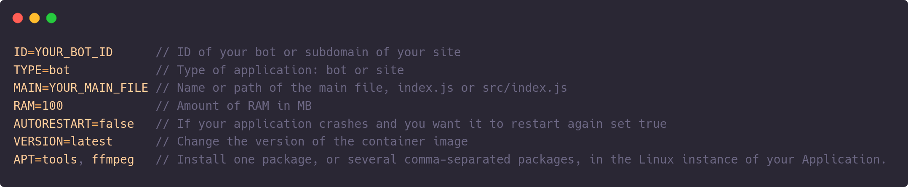
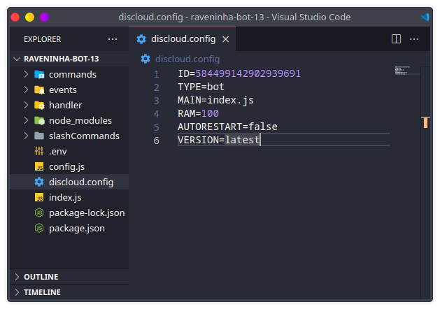

# How to use the discloud.config file?

#### The `discloud.config` is a predefined settings file, so you can upload your applications faster, without having to manually enter this information every time you want to upload.

## :gear: How to Use



> See the list of options for: [VERSION](discloud.config.md#versions-available-in-version), [APT](discloud.config.md#packages-available-in-apt)

> If you are making a `bot` or a `website` you can base yourself on the examples below:




To host a bot you need at least `100MB` of ram



```tsconfig
ID=584499142902939692
TYPE=bot
MAIN=index.js
RAM=100
AUTORESTART=false
VERSION=latest
APT=tools
```





To host a site you need at least `512MB` of ram



```tsconfig
ID=subdominio
TYPE=site
MAIN=index.js
RAM=512
AUTORESTART=false
VERSION=suja
APT=tools
```





Put `discloud.config` in the root of your project and don't forget to include it in your [.zip](zip.md)




## :cloud: Uploading

With your `.zip` created with `discloud.config` it's time to Upload, to use it is very simple!

> * In the command channel type **`.upconfig`** (or short **`.upc`**)
> * Go to the channel the bot just created and place your **.zip**


### Packages available in `APT`

<table><thead><tr><th>Package Name</th><th data-type="select" data-multiple>Dependencies</th></tr></thead><tbody><tr><td>canvas</td><td></td></tr><tr><td>puppeteer</td><td></td></tr><tr><td>java</td><td></td></tr><tr><td>ffmpeg</td><td></td></tr><tr><td>libgl</td><td></td></tr><tr><td>tools</td><td></td></tr></tbody></table>

### Versions available in `VERSION`

> Select a Language to consult



| Available Versions |   |
| ------------------ | - |
| latest             |   |
| current            |   |
| 16.13.2            |   |
| 14.18.3            |   |
| suja               |   |



| Available Versions |
| ------------------ |
| latest             |
| 3.9.10             |
| 2.7.18             |
| suja               |



| Available Versions |
| ------------------ |
| latest             |
| 18.x.x             |
| 17.x.x             |
| 16.x.x             |



| Available Versions |
| ------------------ |
| latest             |
| 3.1.0              |
| 2.7.5              |



| Available Versions |
| ------------------ |
| latest             |
| 1.17.6             |
| 1.16.13            |



| Available Versions |
| ------------------ |
| latest             |


