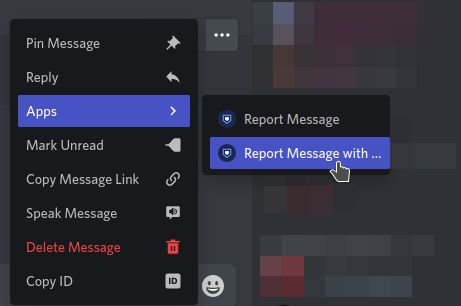

# How to report an offender?

If you see any violators breaking our rules, you can report them using our means of communication - [**Ticket**](report.md#ticket), [**AutoModerator**](report.md#automoderator) and [**Dyno**](report.md#dyno).

###  Ticket

To submit your report by [Ticket](ticket.md) provide the following information: - **Offender ID**; • **Report Description**; • **Evidence**.


[ticket.md](ticket.md)


###  AutoModerator

If you want to report a post that you think is breaking a rule, you can use the **AutoModerator**.

If you want to detail the reason that led you to report the message, follow the instructions below, otherwise go to the first option "**Report Message**":

  

###  Dyno

To report an offender using the report command, you must have [Developer Mode](id-bot.md#activating-developer-mode) enabled, and copy the user ID.


Make sure you have a visual proof in link for your report to be validated.


* Once this is done, just type the command `?r <USER_ID> <Proof> (Reason)` and send your report.
* Example: `?r 369276124817129472 https://i.imgur.com/6876uRv.png Bad words`
