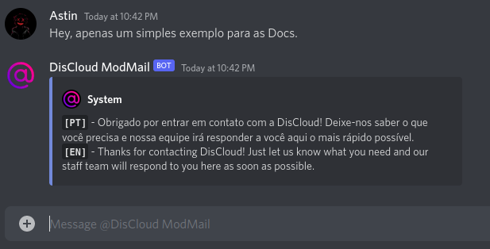

# DisCloud ModMail (Ticket)

##  What is Ticket?

**Ticket** is a Discord bot that allows users to contact **DisCloud Staff** directly in a collective way via the bot's DM, without sending individual messages or publicly pinging staff members on the server.

### When should I use it?

It can deal with delicate and private matters that need the team's intervention, for example:

> * Technical Issues
> * If you have won a raffle
> * Partnership Request
> * Complaints about team members
> * If you need to buy a plan by alternative methods or if the site is not working properly (we accept PayPal, MercadoPago, and Pix)
> * If you need to report a user


#### Just send a DM to a staff member if the bot is unavailable.

The `#📋┃rules` also apply to Ticket.


### How to Use?

Log into the **Ticket** DM and send us your question and wait for a staff member to respond.

Your message has been sent to the Staff and a staff member will respond as soon as possible!
