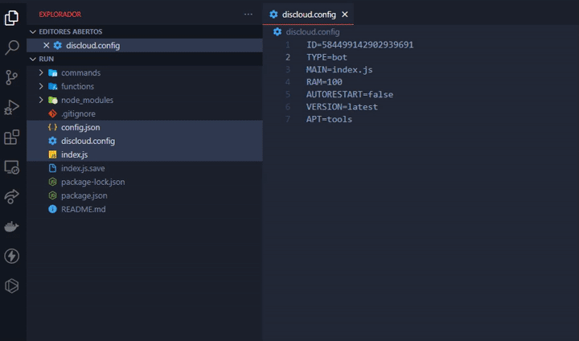
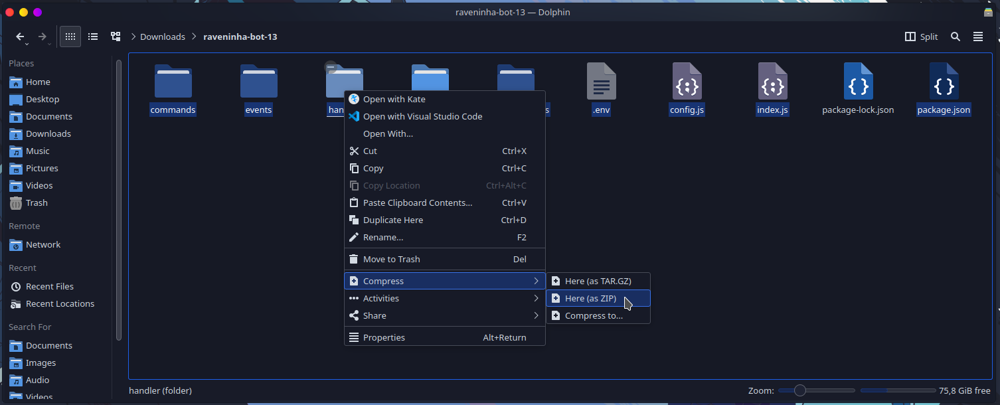
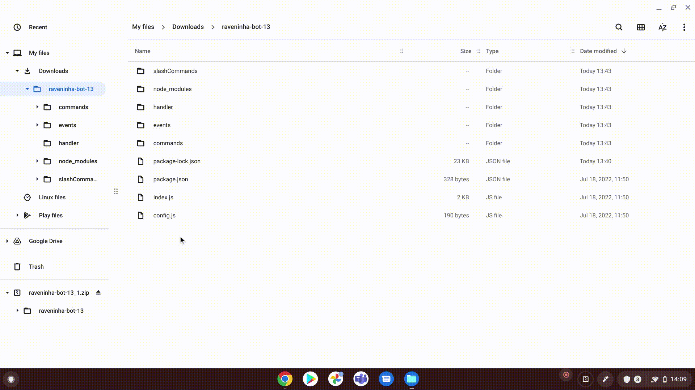

# How to compress my files?

Tips and Tricks

If the `Ctrl` key is pressed while a file is left-clicked, the selection state of this file is switched.

If your bot uses **hidden files** like `.env` to store for example the bot authentication token. You must enable the "Show hidden files" option in the file manager, so that these can be selected

## :compression: Compressing your Files


Select the required files (said in the language tutorials), because not all files are required.


#### Choose below according to your Operating System for more details!



After selecting the required files, right-click on them, drag the mouse to **Send To**, and click **Compressed Folder**.




## Ubuntu


Including other distributions that use the **Gnome** interface


After selecting the required files, right-click on them, click **Compress**, choose a name for the file, and click **Create**.

 

## Kubuntu


Including other distributions with **Kde Plasma** interface.


After selecting the required files, right-click on them, click **Compress** > **Here (as ZIP)**.





On **Android** devices the manufacturers usually ship the system with their own **File Managers** and they can be slightly different, so try replicating the following steps on your device.


Press a file for a while to unlock the selection, then go on marking only the needed files, now look for an icon usually similar to **3 dots or dashes**, and finally look for the **Compress** option

 



After selecting the required files, right-click on them, and click on **Zip Selection**



