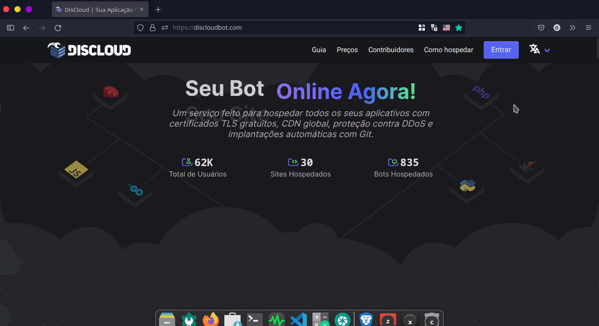

# ☁ How to Host

## ✍ Register

The first step is to **register**. Log in to the [DisCloud](https://discloudbot.com/) website and click on the **Register** button


We recommend you read the [Terms of Service](https://discloudbot.com/legal/terms) and [Usage Policy](https://discloudbot.com/legal/policy) before hosting your bot on DisCloud to avoid suspension of your account from our services or related problems.


### :earth\_americas: Web Hosting&#x20;

Choose a method for hosting your site:


[via-dashboard.md](sites/via-dashboard.md)



[discord.md](sites/discord.md)


### ****:robot: Bot Hosting

Choose a method to host your bot:


[via-dashboard.md](bots/via-dashboard.md)



[discord.md](bots/discord.md)

