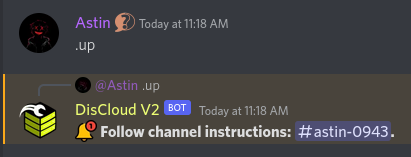
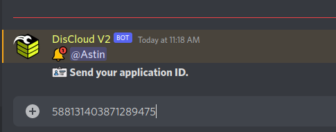
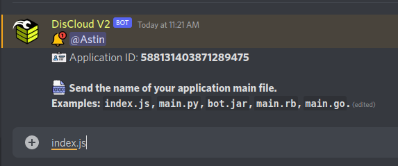
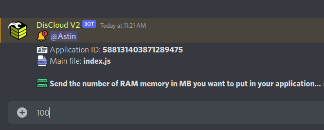
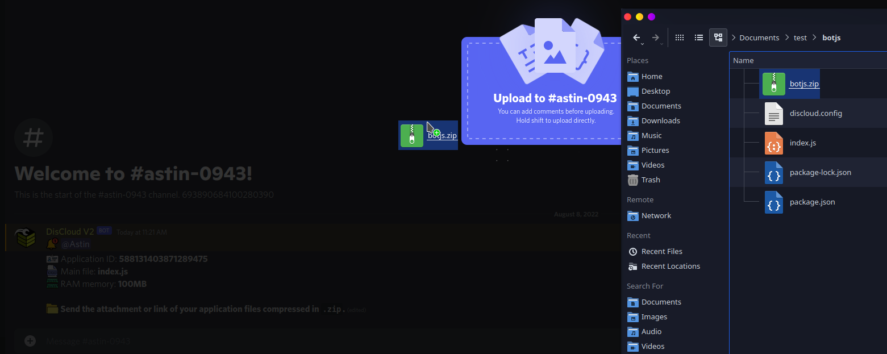

# via Discord

## :cloud: Before Hosting

Before hosting I recommend consulting the documentation of the language used by your bot.


[languages](../../languages/)


### :robot: Hosting Your Bot

If you are `Verified en-us` role, it means that you have successfully registered with **DisCloud**.

#### 1. To host, enter the text channel `🤎┃commands-v2` and type `.up`

#### 2. Paste your bot ID.


[id-bot.md](../../faq/id-bot.md)


#### 3. Enter the name or path of your main file.


[arquivo-principal.md](../../faq/arquivo-principal.md)


#### 4. Enter the amount of RAM (in MB) for your bot.

#### 5. Upload your bot's .zip.


[zip.md](../../faq/zip.md)


> You can refer to the commands using .help or .help \<command> to find out how to use the mentioned command.

### :gear: Using the `discloud.config` file

Send your applications faster!


[discloud.config.md](../../faq/discloud.config.md)

