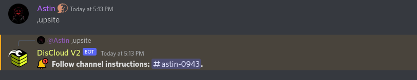

# via Discord

## :cloud: Before Hosting

### Requirements

To host websites you need to fulfill the following [requirements](./#requirements):


[.](./)


Consult the documentation of the language your site uses.


[languages](../../languages/)


### :earth\_americas: Hosting Your Site

If you are `Verified en-us` role, it means that you have successfully registered with DisCloud.

To host, enter the text channel `🤎┃commands-v2` and type `.upsite`

Within this chat will appear instructions that must be filled out correctly to avoid problems.

> You can refer to the commands using .help or .help \<command> to find out how to use the mentioned command.


If you have any questions on how to correctly fill in the information requested by the bot, please refer to our [FAQ](../../faq/)



[faq](../../faq/)



[id-bot.md](../../faq/id-bot.md)



[arquivo-principal.md](../../faq/arquivo-principal.md)



[zip.md](../../faq/zip.md)


### :gear: Using the `discloud.config` file

Send your applications faster!


[discloud.config.md](../../faq/discloud.config.md)

