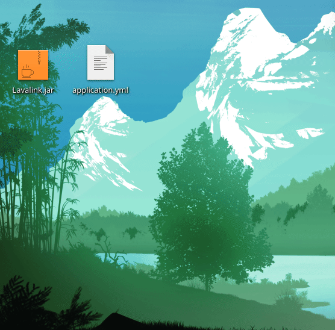
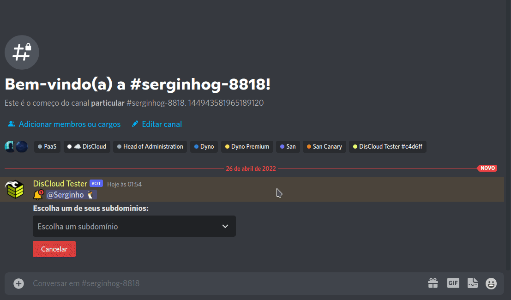

# Lavalink

## How to host Lavalink?

### :pencil: Requirements


The requirements for hosting Lavalink are the same as for hosting a website, you can [check here](../host/sites/#requirements)


### Get started

1. Download `Lavalink.jar` ([main version](https://ci.fredboat.com/viewLog.html?buildId=lastSuccessful\&buildTypeId=Lavalink\_Build\&tab=artifacts\&guest=1) or [dev version](https://ci.fredboat.com/viewLog.html?buildTypeId=Lavalink\_Build\&buildId=lastSuccessful\&buildBranch=refs%2Fheads%2Fdev\&tab=artifacts\&guest=1))
2. Create a file called application.yml ([example](https://github.com/freyacodes/Lavalink/blob/master/LavalinkServer/application.yml.example)) to configure lavalink
3. In the `application.yml` file, set port to `8080`
4. Set up with a strong password so that no one can use your **Lavalink**
5. Faça um zip com esses 2 arquivos.



6\. Now upload it in website mode (by DisCloud use `.upsite`)



7\. Configure your bot to connect as per the example:

> ```json
> {
>   "host": "exemplo.discloud.app",
>   "port": 443,
>   "secure": true,
>   "password": "youshallnotpass"
> }
> ```


Start your bot and test

