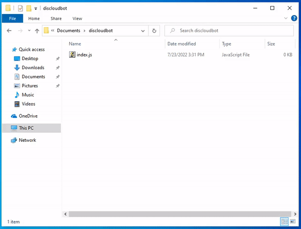

# 📄 Create the package.json

The `package.json` file is a kind of manifest for your project. It can do a lot of things, it is also where **npm** stores the **names** and **versions** of all the installed packages that your project depends on.

### How do I create the `package.json` file?

Open the Terminal in your project's directory (Windows use: **Shift+Right Button** and click **Open PowerShell**) and type:

```
npm init -y
```




You need **NodeJS** and **npm** installed on your computer, if it is not installed follow the instructions below.


### Install Nodejs and npm on your computer

> **npm** - Official NodeJS Package Manager

> Select your Operating System



### Installing Nodejs and Npm

### [Download the Nodejs Here](https://nodejs.org/en/)

.png>)

### Check the NodeJS Installation

Open **cmd** or **PowerShell** and type:

```
node -v
```

### Check the npm Installation

Open **cmd** or **PowerShell** and type:

```
npm -v
```


#### If it returns the version of both then it is installed correctly!




### Installing Nodejs and Npm

###  Ubuntu

If you use **Ubuntu** or some distro based on it know that not always the **nodejs LTS** version of the **Ubuntu** [repositories](https://packages.ubuntu.com/search?keywords=nodejs\&searchon=names\&suite=all\&section=all) is the latest one, so I recommend following the instructions below:

```
curl -fsSL https://deb.nodesource.com/setup_16.x | sudo -E bash -
sudo apt install -y nodejs
```


The **nodejs** package already installs **npm**


For other versions see [here](https://github.com/nodesource/distributions/blob/master/README.md#installation-instructions)

Repository Package Information: [nodejs](https://packages.ubuntu.com/search?keywords=nodejs\&searchon=names\&suite=all\&section=all), [npm](https://packages.ubuntu.com/search?suite=all\&section=all\&arch=any\&keywords=npm\&searchon=names)

###  Fedora

The **nodejs LTS** version present in the [repositories](https://packages.fedoraproject.org/pkgs/nodejs/nodejs/) is usually quite recent, you can install it by typing in Terminal:

```
sudo dnf install nodejs npm -y
```

Repository Package Information: [nodejs](https://packages.fedoraproject.org/pkgs/nodejs/nodejs/), [npm](https://packages.fedoraproject.org/pkgs/nodejs/npm/)

###  Arch Linux

The repositories for Arch Linux and its derivatives have the latest packages, __ **nodejs LTS** __ and **node latest** is available.

Type the following command to install **v16.x.** (more details see [Arch Wiki](https://wiki.archlinux.org/title/Node.js#Installation))

```
sudo pacman -S nodejs-lts-gallium npm
```

Repository Package Information: [nodejs](https://archlinux.org/packages/community/x86\_64/nodejs-lts-gallium/), [npm](https://archlinux.org/packages/community/any/npm/)

### Check the NodeJS Installation

Type the following command in Terminal.

```
node -v
```

### Verifique a Instalação do npm

Type the following command in Terminal.

```
npm -v
```


Se retornar a versão de ambos então está instalado corretamente!




### Putting dependencies in your `package.json`

#### Installing [discord.js](https://www.npmjs.com/package/discord.js?source=post\_page-----7b5fe27cb6fa----------------------)

To install, type in your Terminal

```
npm install discord.js
```

Your `package.json` should look like this.


```json
{
  "name": "discloudbot",
  "version": "1.0.0",
  "description": "",
  "main": "index.js",
  "scripts": {
    "test": "echo \"Error: no test specified\" && exit 1"
  },
  "keywords": [],
  "author": "",
  "license": "ISC",
  "dependencies": {
    "discord.js": "^14.0.3"
  }
}
```

