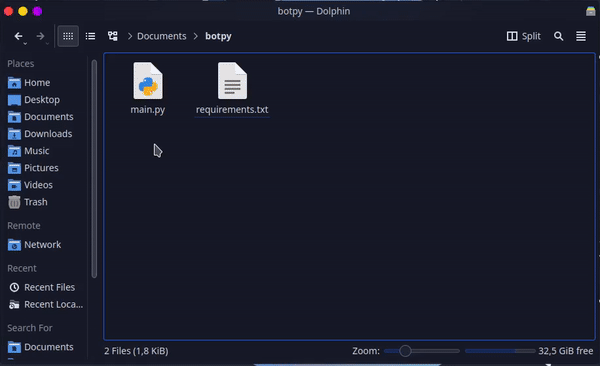

# 🐍 Python

## :file\_folder: Files

You should not send all your application files to `.zip`, there are some exceptions, they are:

```diff
- Folder .git
```

> * Have trouble finding your main file? [Click here](../../faq/arquivo-principal.md#arquivos-principais-gerais)
> * Doubts about creating your `requirements.txt` file? [Click here](requirements.txt.md)


[requirements.txt.md](requirements.txt.md)


## :compression: Compressing the Files

Select only the necessary files as mentioned above and create your `.zip`



For more details on how to **Compress your Files** according to your **Operating System**, you can see below:


[zip.md](../../faq/zip.md)


## ✍ Hosting your bot


Choose the method for hosting your bot in the Discloud:



[via-dashboard.md](../../host/sites/via-dashboard.md)



[discord.md](../../host/bots/discord.md)

