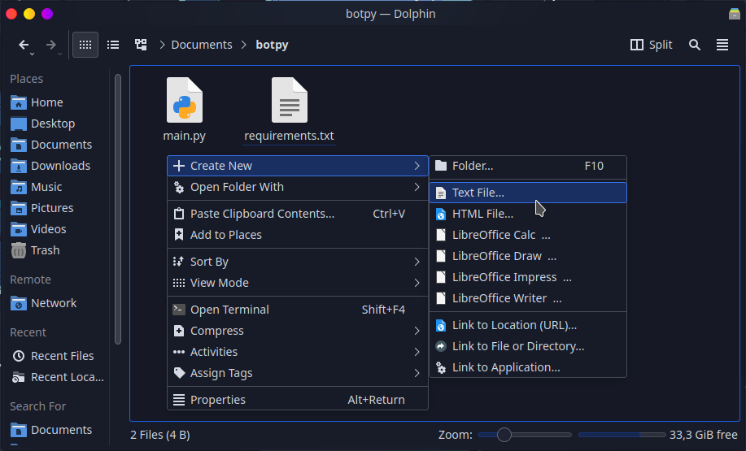
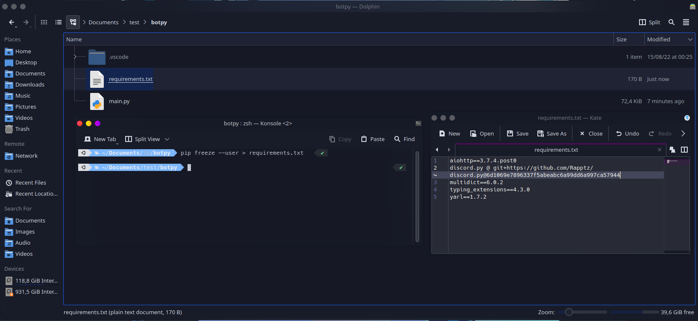

# 📄 Create the requirements.txt

It is a **simple text file** that saves a list of **packages** needed by your project.

## How do I create the `requirements.txt` file?

Start by going into your project directory and create a new txt file and make sure it is **named** `requirements.txt`



### Putting packages in your `requirements.txt`


The libraries are not the ones you **import** into your code, but the ones you install with **pip install**.


#### discord.py (PyPI) (Stable)

Add the following line to your `requirements.txt`


```
discord.py
```


When we don't specify a version, pip will always try to install the latest version of the specified package. We can specify versions in the following ways:

> * `discord.py==2.0.0` - Sets a specific version to be installed. Fixing the version in this way ensures that your project will always be working, in case your code is not yet adapted to a higher version
> * `discord.py>=2.0.0`: When we use the `>=` sign we are saying that we want to install any higher or equal version of the library.

#### discord.py (git) (Unstable)

Add the following line to your `requirements.txt`


```python
git+https://github.com/Rapptz/discord.py
```


This way we can install **Python** packages that are available on **GitHub** but not on **PyPI**, such as development versions.

### Automatically add packages

If you have **Python** installed on your computer you can run a simple command in your Terminal to put all **the libraries** and **their versions** in a `requirements.txt`


Make sure you have all the packages your project requires installed on your computer before running


Open the Terminal in your project's directory (Windows use: **Shift+Right Button** and click **Open PowerShell**) and run:

```
pip freeze --user > requirements.txt
```

> **--user** - Only output packages installed in user-site




You need **python** and **pip** installed on your computer, if not, follow the instructions below.


### Install `Python` on your computer

> **pip** - Install Python on your computer

> Select your Operating System



### Installing `Python`

### [Download Python Here](https://www.python.org/downloads/)


### Check the `Python` installation

Open **cmd** or **PowerShell** and type:

```
python --version
```

### Check the `pip` installation

Open **cmd** or **PowerShell** and type:

```
pip -V
```


If it returns the version of both then it is installed correctly!




### Installing `Python`

###  Ubuntu

If you use **Ubuntu** or any distro based on it, type the following command in Terminal:

```
sudo apt install python3 python3-pip
```

Repository Package Information: [python](https://packages.ubuntu.com/search?suite=all\&section=all\&arch=any\&keywords=python3\&searchon=names), [pip](https://packages.ubuntu.com/search?suite=all\&section=all\&arch=any\&keywords=python3-pip\&searchon=names)

###  Fedora

If you use Fedora, type the following command in Terminal

```
sudo dnf install python3 python3-pip
```

Repository Package Information: [python](https://packages.fedoraproject.org/pkgs/python3.10/python3/), [pip](https://packages.fedoraproject.org/pkgs/python-pip/python3-pip/)

###  Arch Linux

If you use **Arch Linux** or any distro based on it, type the following command in Terminal:

```
sudo pacman -S python python-pip
```

Repository Package Information: [python](https://archlinux.org/packages/core/x86\_64/python/), [pip](https://archlinux.org/packages/extra/any/python-pip/)

### Check the `Python` installation

Open **Terminal** and type:

```
python --version
```

### Check the `pip` installation

Open **Terminal** and type:

```
pip -V
```


If it returns the version of both then it is installed correctly!



