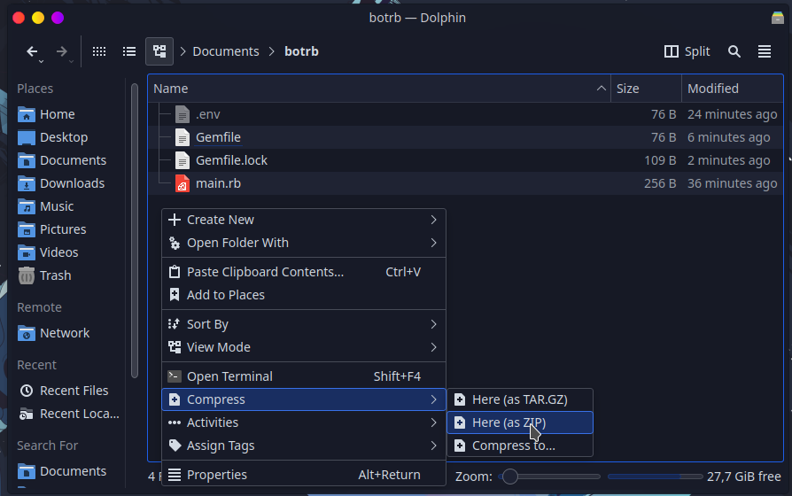

# 💎 Ruby


#### Translation in progress


## :file\_folder: Arquivos

**Não envie todos os arquivos** de uma vez, você precisará colocar apenas os arquivos necessários do seu bot em um arquivo compactado`.zip`.&#x20;

```diff
Arquivos Mínimos Necessários
+ Arquivo Principal (Exemplo: main.rb, bot.rb...)
+ Arquivo Gemfile
+ Outros (Se o seu bot depender de outros arquivos ou pastas deve incluir)
Não Necessários
- Arquivo Gemfile.lock
- Pasta .git
- Arquivo LICENSE
```

> * Dúvidas para encontrar o seu arquivo principal? [Clique aqui](../../faq/arquivo-principal.md#arquivos-principais-gerais)
> * Dúvidas em criar o seu  arquivo `Gemfile`? [Clique aqui](../../../suporte/linguagens/ruby/gemfile.md)


[gemfile.md](../../../suporte/linguagens/ruby/gemfile.md)


### :compression: Compactando os Arquivos

Selecione apenas os arquivos necessários, como mencionado em cima e crie o seu **.zip**



Para mais detalhes sobre como **Compactar os seus Arquivos** de acordo com o seu **Sistema Operativo**, pode consultar em baixo:


[zip.md](../../faq/zip.md)


## ✍ Hospedando o seu bot


Escolha o método para hospedar seu Bot na Discloud:



[via-dashboard.md](../../host/bots/via-dashboard.md)



[discord.md](../../host/bots/discord.md)


## :earth\_americas: Hospedando o Seu Site


Esta funcionalidade necessita de alguns requisitos básicos para poder ser utilizada, por favor consulte os requisitos [aqui](../../host/sites/#requisitos) antes de continuar


### Utilizando o `Ruby On Rails`

**`Rails`** é uma ferramenta de desenvolvimento que dá aos desenvolvedores web uma estrutura, pode ser usada na construção de Sites ou APIs.

### Instalando o `Rails`

Consulte a documentação oficial abaixo.



### Configurando o `Rails`

Você precisa de adicionar o seu **subdomínio** (ou **domínio**) nos hosts permitidos do `Rails`.

> * Edite o arquivo `config/application.rb`
> * Modifique a **linha 19**, com o seu dominio


```ruby
require_relative "boot"

require "rails/all"

# Require the gems listed in Gemfile, including any gems
# you've limited to :test, :development, or :production.
Bundler.require(*Rails.groups)

module RailsOnDiscloud
  class Application < Rails::Application
    # Initialize configuration defaults for originally generated Rails version.
    config.load_defaults 7.0
    # config.time_zone = "Central Time (US & Canada)"
    # config.eager_load_paths << Rails.root.join("extras")
    Rails.application.config.hosts = [
    IPAddr.new("0.0.0.0/0"),        # All IPv4 addresses.
    IPAddr.new("::/0"),             # All IPv6 addresses.
    "localhost",                    # The localhost reserved domain.
    "yourdomain.discloud.app"       # !!!! Discloud Domain !!!!!
]
  end
end

```


#### Exemplo `discloud.config` para `Rails`


[discloud.config.md](../../faq/discloud.config.md)



```typescript
ID=subdomino
TYPE=site
MAIN=config/application.rb
RAM=512
AUTORESTART=false
VERSION=latest
APT=tools
```

