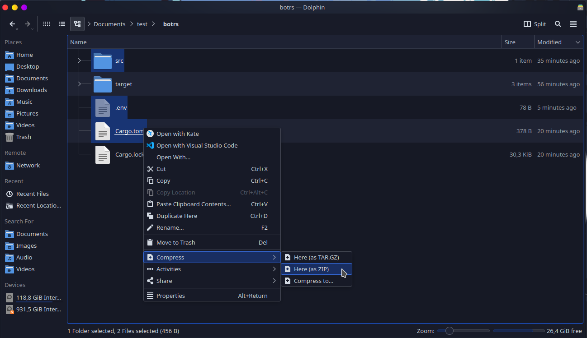

# 🦀 Rust

## :file\_folder: Files

You should not send all your application files to `.zip`, there are some exceptions, they are:

```diff
- File Cargo.lock
- File .gitignore
- Folder target
- Folder .git
```


[cargo.md](cargo.md)


## :compression: Compressing the Files

For more details on how to **Compress your Files** according to your **Operating System**, you can see below




[zip.md](../../faq/zip.md)


## ✍ Hosting your bot


Choose the method for hosting your bot in the Discloud:



[via-dashboard.md](../../host/bots/via-dashboard.md)



[discord.md](../../host/bots/discord.md)


## :earth\_americas: Hosting Your Site


This feature needs some basic requirements to be able to be used, please check the requirements [here](../../host/sites/#requirements) before continuing


### Using `Rocket`

**Rocket** is a web framework built in rust, currently it only works in the nightly version of rust

```shell
rustup override set nightly
```

### Installing `Rocket`

Consult the official documentation: [https://rocket.rs/](https://rocket.rs/)

### Configuring `Rocket` for DisCloud

Create an`rust-toolchain.toml` file:


```toml
[toolchain]
channel = "nightly"
```


This will instruct `rustup` to use the `nightly` version, and download that version if necessary.

`discloud.config` example for `Rocket`


```typescript
ID=subdomino
TYPE=site
MAIN=src/main.rs
RAM=512
AUTORESTART=false
VERSION=latest
APT=tools
```

