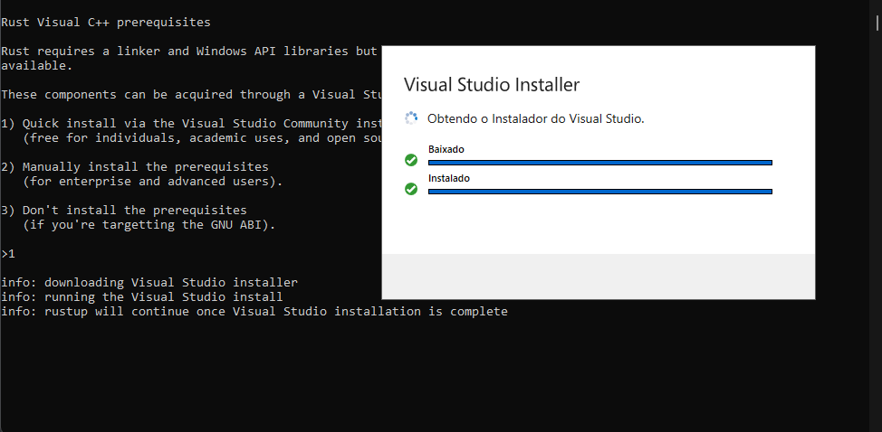

# 📄 Create the Cargo.toml

The `Cargo.toml` file is a manifest file for the Cargo **package manager**. This file contains metadata like **name**, **version** and **dependencies** for packages, which are called "[crates](https://crates.io/)" in **Rust**.

### How to create `Cargo.toml` file?

#### Starting a new [package](https://doc.rust-lang.org/cargo/appendix/glossary.html#package) with Cargo in an existing directory

Open Terminal in your project directory and run:

```shell
cargo init
```

> If you prefer Cargo to create the directory automatically use `cargo new botrs`


Modify `botrs` to your project name following **snake\_case** or **kebab-case** structure




You need **Rust** and **Cargo** installed on your computer, if not, follow the instructions below.


### Install Rust and Cargo on your computer

> **cargo** - **Rust** official package manager

> Select your Operating System



#### Installing Rust and Cargo

[Download Rust Here](https://static.rust-lang.org/rustup/dist/i686-pc-windows-gnu/rustup-init.exe)

> [Other installation methods](https://forge.rust-lang.org/infra/other-installation-methods.html)



#### Check the Rust Installation

Open **cmd** or **PowerShell** and type:

```
rustc --version
```

#### Check the Cargo Installation

Open **cmd** or **PowerShell** and type:

```
cargo --version
```


If it returns the version of both then it is installed correctly!




### Instalação do Rust e Cargo

### &#x20;   

If you are on any **Linux**, **Mac OS**, or other **Unix-like** distro, run the following command in your Terminal

```shell
curl --proto '=https' --tlsv1.2 -sSf https://sh.rustup.rs | sh
```

### Check the Rust Installation

Open **Terminal** and run:

```shell
rustc --version
```

### Check the Cargo Installation

Open **Terminal** and run:

```shell
cargo --version
```


If it returns the version of both then it is installed correctly!




### Putting dependencies in your `Cargo.toml` file

#### Installing [serenity](https://github.com/serenity-rs/serenity)

> **Serenity** - is a Rust library for the Discord API.

Add the following line to your `Cargo.toml` file or run `cargo add serenity`


```toml
[dependencies]
serenity = "0.11"
```

