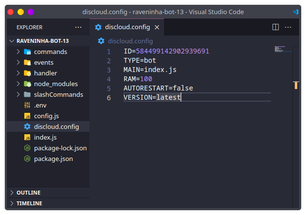

# Como utilizar o arquivo discloud.config?

#### O `discloud.config` é um arquivo de configurações predefinidas, para que você possa enviar as suas aplicações mais rapidamente, sem ter que digitar manualmente estas informações sempre que desejar fazer upload.

## :gear: Como Utilizar


> Consulte a lista de opções para: [VERSION](discloud.config.md#versoes-disponiveis-no-version), [APT](discloud.config.md#pacotes-disponiveis-no-apt)

> Se estiver fazendo um `bot` ou um `site` pode se basear nos exemplos abaixo:




```tsconfig
ID=584499142902939692
TYPE=bot
MAIN=index.js
RAM=100
AUTORESTART=false
VERSION=latest
APT=tools
```





Para hospedar um site precisa de `512MB` de ram no mínimo



```tsconfig
ID=subdominio
TYPE=site
MAIN=index.js
RAM=512
AUTORESTART=false
VERSION=suja
APT=tools
```





Coloque o `discloud.config` na raiz do seu projeto e não se esqueça de incluir no seu [.zip](zip.md)




## :cloud: Fazendo o Upload

Com o seu [.zip ](zip.md)criado com o `discloud.config` chegou a hora do Upload, para utilizar é muito simples!

> * No canal de comandos digite `.upconfig` (ou abreviação `.upc`)
> * Entre no canal que o bot acabou de criar e coloque o seu .zip


### Pacotes disponíveis no `APT`

<table><thead><tr><th>Nome Do Pacote</th><th data-type="select" data-multiple>Dependências</th></tr></thead><tbody><tr><td>canvas</td><td></td></tr><tr><td>puppeteer</td><td></td></tr><tr><td>java</td><td></td></tr><tr><td>ffmpeg</td><td></td></tr><tr><td>libgl</td><td></td></tr><tr><td>tools</td><td></td></tr></tbody></table>

### Versões disponíveis no `VERSION`

> Selecione uma Linguagem para consultar



| Versões Disponíveis |   |
| ------------------- | - |
| latest              |   |
| current             |   |
| 16.13.2             |   |
| 14.18.3             |   |
| suja                |   |



| Versões Disponíveis |
| ------------------- |
| latest              |
| 3.9.10              |
| 2.7.18              |
| suja                |



| Versões Disponíveis |
| ------------------- |
| latest              |
| 18.x.x              |
| 17.x.x              |
| 16.x.x              |



| Versões Disponíveis |
| ------------------- |
| latest              |
| 3.1.0               |
| 2.7.5               |



| Versões Disponíveis |
| ------------------- |
| latest              |
| 1.17.6              |
| 1.16.13             |



| Versões Disponíveis |
| ------------------- |
| latest              |


