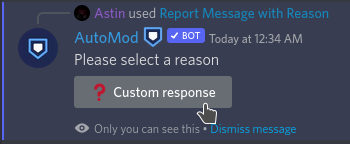
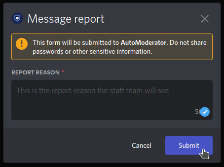

# Como reportar um infrator?

Caso você veja algum infrator violando nossas regras, você pode reportá-lo utilizando nossos meios de comunicação - **Ticket, AutoModerator e Dyno.**

###  Ticket

Para enviar seu relatório pelo [Ticket](ticket.md) forneça as seguintes informações: • ID do Infrator; • Descrição do Relatório; • Prova.


[ticket.md](ticket.md)


###  AutoModerator

Se desejar reportar uma mensagem que ache que esteja quebrando alguma regra pode usar o **AutoModerator.**

Se desejar detalhar o motivo que levou a realizar o report da mensagem siga as instruções abaixo caso contrário vá na primeira opção "**Report Message**":

  

###  Dyno

Para reportar um infrator usando o comando de report, é necessário que você tenha o [**Modo Desenvolvedor**](id-bot.md#ativando-modo-desenvolvedor) habilitado, e copie o ID do usuário.&#x20;


Certifique-se de ter uma prova visual em link para que seu report seja validado.


* Feito isto, basta digitar o comando `?r <USER_ID> <Proof> (Reason)` e enviar seu relatório.
* Exemplo: `?r 369276124817129472 https://i.imgur.com/6876uRv.png Bad words`
