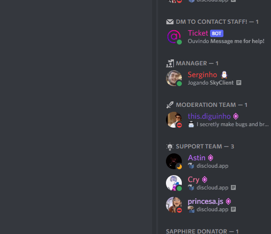
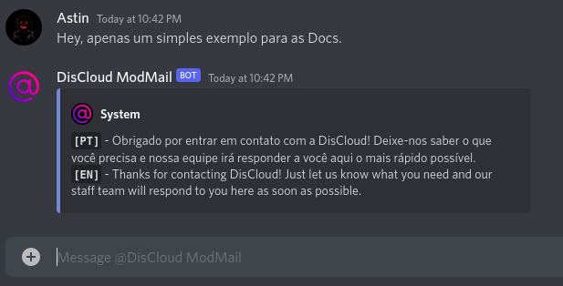

# DisCloud ModMail (Ticket)

##  O que é o Ticket?

O **Ticket** é um bot do Discord que permite aos usuários entrarem em contato diretamente com a Staff da **DisCloud** de forma coletiva através do DM do bot, sem enviar mensagens individuais ou pingar publicamente os membros da equipe no servidor.

### Quando Devo Utilizar?

Pode Tratar de assuntos delicados e particulares que necessitam da intervenção da equipe, por exemplo:

> * Problemas Técnicos
> * Caso tenha ganho algum sorteio
> * Solicitação de parceria
> * Reclamações sobre membros da equipe
> * Caso precise de comprar um plano  por metodos alternativos ou caso o site não esteja a funcionar corretamente (aceitamos PayPal, MercadoPago, e Pix)
> * Se precisar de reportar um usuário


**Apenas mande DM para um membro da Equipe caso o bot esteja indisponível.**

**As `#📋┃rules` também se aplicam ao Ticket.**


### Como Utilizar?

Entre na DM do **Ticket** e envie-nos a sua questão e aguarde um membro da equipe responder.

A sua mensagem foi enviada para a Staff e um membro da equipe ir responder o quanto possível!
