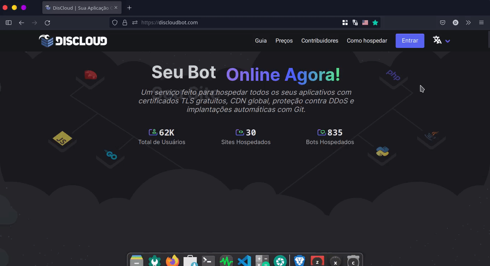

# ☁ Como Hospedar

## ✍ Registro

O primeiro passo é fazer o seu **registro**. Entre no site da [DisCloud](https://discloudbot.com) e clique no botão **Registrar**


Recomendamos você ler os [Termos de Serviço](broken-reference) e [Política de Uso](broken-reference) antes de hospedar seu bot na DisCloud para evitar a suspensão da sua conta de nossos serviços ou problemas relacionados.


### :earth\_americas: Hospedar Sites

Escolha um método para hospedar o seu site:


[via-painel-controle.md](bots/via-painel-controle.md)



[discord.md](sites/discord.md)


### ****:robot: **Hospedar Bots**

Escolha um método para hospedar o seu bot:


[via-painel-controle.md](sites/via-painel-controle.md)



[discord.md](bots/discord.md)

