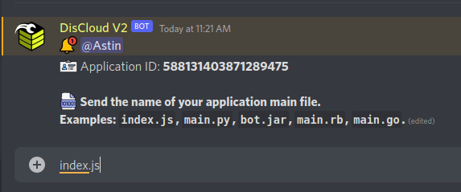

# via Discord

## :cloud: Antes de Hospedar

Antes de hospedar recomendo consultar a documentação da linguagem utilizada pelo seu bot.


[linguagens](../../linguagens/)


### :robot: Hospedando o Seu Bot

Se você estiver com o cargo `Verified pt-br`, significa que você se registrou com sucesso na **DisCloud**.&#x20;

#### 1. Para hospedar, entre no canal de texto `🤎┃commands-v2` e digite `.up`.

#### 2. Cole o ID do seu bot.


[id-bot.md](../../faq/id-bot.md)


#### 3. Digite o nome ou caminho do seu arquivo principal.


[arquivo-principal.md](../../faq/arquivo-principal.md)


#### 4. Digite a quantidade de RAM (em MB) para o seu bot.

#### 5.  Envie o .zip do seu bot.


[zip.md](../../faq/zip.md)


> Você pode consultar os comandos utilizando `.help` ou `.help <comando>` para saber como utilizar o comando mencionado.

### :gear: Utilizando o arquivo `discloud.config`

#### Envie as suas aplicações mais rapidamente!


[discloud.config.md](../../faq/discloud.config.md)

