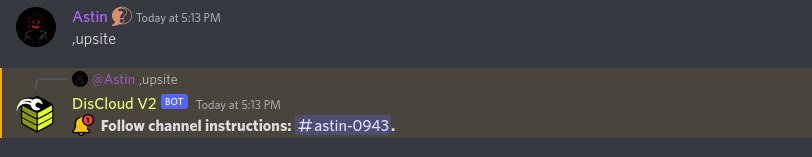
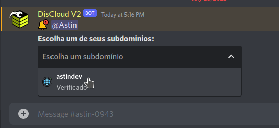

# via Discord

## :cloud: Antes de Hospedar

### Requisitos

Para hospedar sites você precisa cumprir os seguintes [requisitos](discord.md#undefined):


[.](./)


Consulte a documentação da linguagem utilizada pelo seu site.


[linguagens](../../linguagens/)


### :earth\_americas: Hospedando o Seu Site

Se você estiver com o cargo `Verified pt-br`, significa que você se registrou com sucesso na **DisCloud**.&#x20;

Para hospedar, entre no canal de texto `🤎┃commands-v2` e digite `.upsite`.

Dentro desse chat aparecerá as instruções que deverão ser preenchidas corretamente para evitar problemas.

> Você pode consultar os comandos utilizando `.help` ou `.help <comando>` para saber como utilizar o comando mencionado.

### :gear: Utilizando o arquivo `discloud.config`

#### Envie as suas aplicações mais rapidamente!


[discloud.config.md](../../faq/discloud.config.md)


### :mag\_right: Problemas Comuns


[porque-nao-consigo-acessar-o-meu-site.md](../../faq/porque-nao-consigo-acessar-o-meu-site.md)

