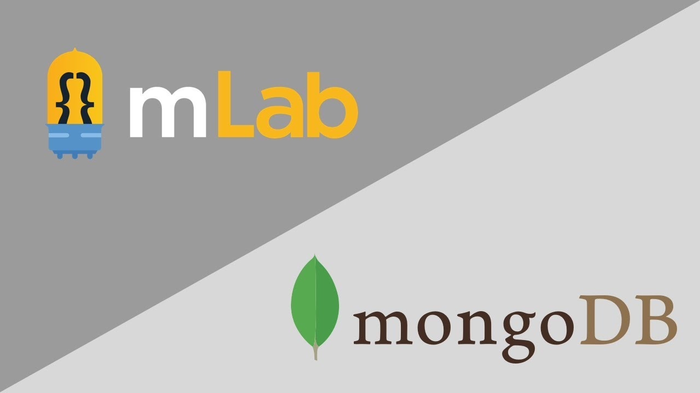

# MongoDB Atlas \(mLab\)



## Ao conectar seu banco [MongoDB](https://mlab.com/) a um Bot Discord hospedado na DisCloud você pode se deparar com o possível erro:


```javascript
Erro ao Conectar na MeuDB: MongoNetworkError: connection 0 to meudb-shard-00-00-9m7sg.mongodb.net:27017 closed
```


Você receberá essa mensagem de erro se não tiver incluído na lista branca os endereços do MongoDB Atlas, o IP de onde seu Bot está hospedado.


**Devido ao modo como o DisCloud funciona, não podemos fornecer um endereço IP para você.**


Então de acordo com o [documentação](https://docs.atlas.mongodb.com/security-whitelist/) do MongoDB Atlas, a única maneira de fazer com que as instancias da DisCloud se conecte ao seu banco, é adicionar **`0.0.0.0/0`**\(ou seja, todos os endereços\) à sua lista de permissões do MongoDB Atlas.


