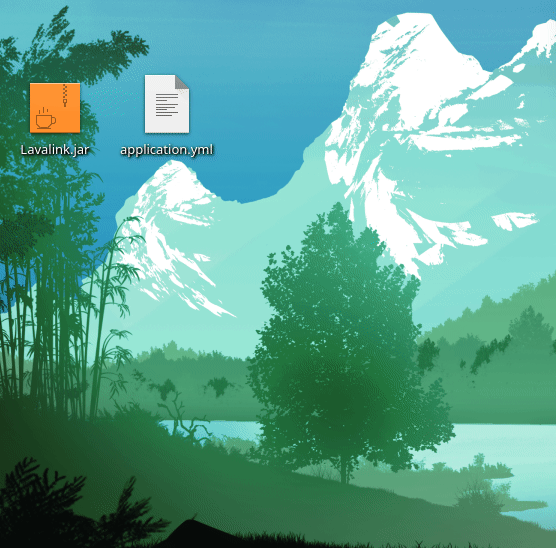
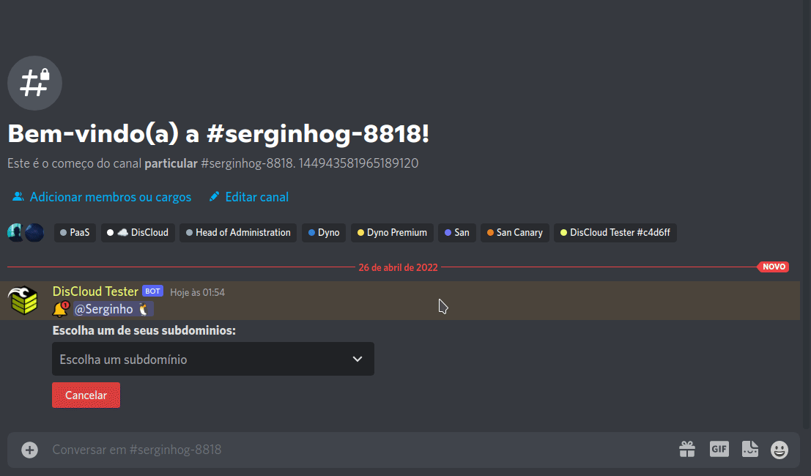

# Lavalink

## Como hospedar o Lavalink?

### :pencil: Requisitos


Os requisitos para hospedar o Lavalink são os mesmo que hospedar um site, pode consultar [aqui](../hospedar/sites/#requisitos)


## Introdução

1. Baixe o `Lavalink.jar` ([versão principal](https://ci.fredboat.com/viewLog.html?buildId=lastSuccessful\&buildTypeId=Lavalink\_Build\&tab=artifacts\&guest=1) ou [versão dev](https://ci.fredboat.com/viewLog.html?buildTypeId=Lavalink\_Build\&buildId=lastSuccessful\&buildBranch=refs%2Fheads%2Fdev\&tab=artifacts\&guest=1))
2. Crie um arquivo chamado `application.yml` ([exemplo](https://github.com/freyacodes/Lavalink/blob/master/LavalinkServer/application.yml.example)) para configurar o lavalink
3. No arquivo `application.yml` sete `port` para **`8080`**
4. Configure com uma password forte para que ninguém use o seu **Lavalink**
5. Faça um zip com esses 2 arquivos.



6\. Agora faça o upload em modo site (pela discloud use `,upsite`)



7\. Configure o seu **bot** para conectar conforme o exemplo:

> ```json
> {
>   "host": "exemplo.discloud.app",
>   "port": 443,
>   "secure": true,
>   "password": "youshallnotpass"
> }
> ```


Inicie o seu bot e teste

