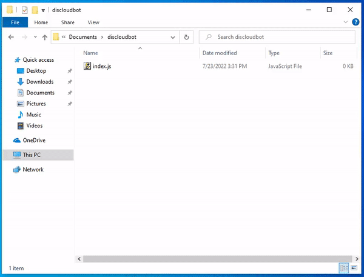

# 📄 Criar o package.json

O arquivo `package.json` é uma espécie de manifesto para seu projeto. Ele pode fazer um monte de coisas, é também onde o **npm** armazena os **nomes** e **versões** de todos os **pacotes instalados** que o seu projeto depende.

### Como criar o arquivo `package.json`?

Abra o Terminal no diretório do seu projeto (Windows use: **Shift+Botão Direito** e clique em **Open PowerShell**) e digite:

```
npm init -y
```




Você precisa do **NodeJS e npm** instalado no seu computador, caso não esteja instalado siga as instruções abaixo.


### Instale o Nodejs e npm no seu computador

> **npm** - Gerenciador de pacotes oficial do NodeJS

> Selecione o seu Sistema Operacional



### Instalação do Nodejs e Npm

### [Baixe o Nodejs Aqui](https://nodejs.org/en/)

.png>)

### Verifique a Instalação do NodeJS

Abra o **cmd** ou **PowerShell** e digite**:**

```
node -v
```

### Verifique a Instalação do npm

Abra o **cmd** ou **PowerShell** e digite:

```
npm -v
```


Se retornar a versão de ambos então está instalado corretamente!




### Instalação do Nodejs e Npm

###  Ubuntu

Se você usa **Ubuntu** ou alguma distro baseada nele saiba que nem sempre a versão **nodejs LTS** dos [repositórios](https://packages.ubuntu.com/search?keywords=nodejs\&searchon=names\&suite=all\&section=all) do **Ubuntu** é a mais recente, por isso recomendo seguir as instruções abaixo:

```
curl -fsSL https://deb.nodesource.com/setup_16.x | sudo -E bash -
sudo apt install -y nodejs
```


O pacote **nodejs** já instala o **npm**


Outras versões consulte [aqui](https://github.com/nodesource/distributions/blob/master/README.md#installation-instructions)

Informações dos pacotes dos Repositórios: [nodejs](https://packages.ubuntu.com/search?keywords=nodejs\&searchon=names\&suite=all\&section=all), [npm](https://packages.ubuntu.com/search?suite=all\&section=all\&arch=any\&keywords=npm\&searchon=names)

###  Fedora

A versão do **nodejs LTS** presente nos [repositórios](https://packages.fedoraproject.org/pkgs/nodejs/nodejs/) custuma ser bem recente, pode instalalar digitando no Terminal:

```
sudo dnf install nodejs npm -y
```

Informações dos pacotes dos Repositórios: [nodejs](https://packages.fedoraproject.org/pkgs/nodejs/nodejs/), [npm](https://packages.fedoraproject.org/pkgs/nodejs/npm/)

###  Arch Linux

Os repositórios dos Arch Linux e derivados dele, têm os mais recentes pacotes, está disponivel o **nodejs LTS e** **node latest.**&#x20;

Digite o seguinte comando para instalar a **v16.x.** _(mais detalhes consulte_ [_Arch Wiki_](https://wiki.archlinux.org/title/Node.js#Installation)_)_

```
sudo pacman -S nodejs-lts-gallium npm
```

Informações dos pacotes dos Repositórios: [nodejs](https://archlinux.org/packages/community/x86\_64/nodejs-lts-gallium/), [npm](https://archlinux.org/packages/community/any/npm/)

### Verifique a Instalação do NodeJS

Digite no Terminal o seguinte comando.

```
node -v
```

### Verifique a Instalação do npm

Digite no Terminal o seguinte comando.

```
npm -v
```


Se retornar a versão de ambos então está instalado corretamente!




### Colocando dependências no seu `package.json`

#### Instalando o [discord.js](https://www.npmjs.com/package/discord.js?source=post\_page-----7b5fe27cb6fa----------------------)

Para instalar digite

```
npm install discord.js
```

O seu `package.json` deve estar com a seguinte aparência.


```json
{
  "name": "discloudbot",
  "version": "1.0.0",
  "description": "",
  "main": "index.js",
  "scripts": {
    "test": "echo \"Error: no test specified\" && exit 1"
  },
  "keywords": [],
  "author": "",
  "license": "ISC",
  "dependencies": {
    "discord.js": "^14.0.3"
  }
}
```

