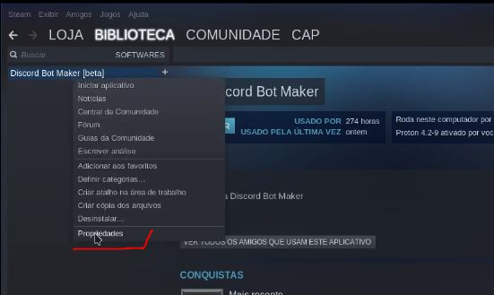
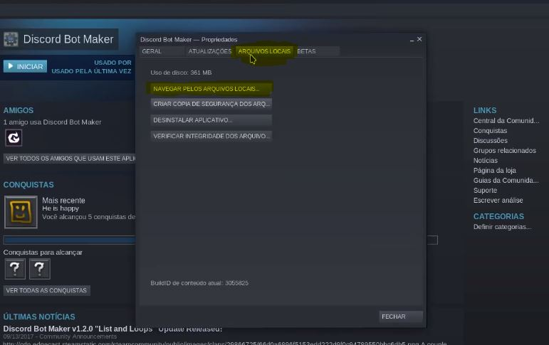

# Discord Bot Maker


Créditos ao [Cap](https://discordapp.com/users/293860296542388234) pelo tutorial apresentado



**Tutorial apenas para a versão beta do DBM!**




## 📥 Preparando os arquivos

**1.** Acesse a pasta do seu bot.

**2.** Abra sua Steam e acesse a biblioteca aonde está o Discord Bot Maker.

**3.** Clique com o botão direito do mouse sobre **Discord Bot Maker** na sua Steam, e clique em **Propriedades**.

**4.** Dentro de **Propriedades**, clique em **ARQUIVOS LOCAIS**, e por último, em **NAVEGAR PELOS ARQUIVOS LOCAIS**, e então você deve está na pasta aonde está instalado o Discord Bot Maker.

**4.** Com a pasta do seu bot aberta, e a do Discord Bot Maker também, copie a pasta **actions** do diretório do seu DBM e cole-á na pasta do seu bot.

**5.** Por fim, compacte os arquivos do seu bot em um `.zip`, e não a pasta do seu bot! Zipe juntos os seguintes arquivos: **actions**, **data**, **fonts**, **resources**, **bot.js** e **package.json**.


Na última atualização **1.5.9 do DBM** agora existe também a pasta extensions e events, compacte elas se você usa alguma extension ou event da pasta no seu bot!


> Caso não saiba compactar os arquivos, visite nossa FAQ:



## ✍ Hospedando o seu Bot na DisCloud

Você pode aprender a hospedar seu Bot na versão website ou Discord





### 🎥 **Vídeo tutorial**:



