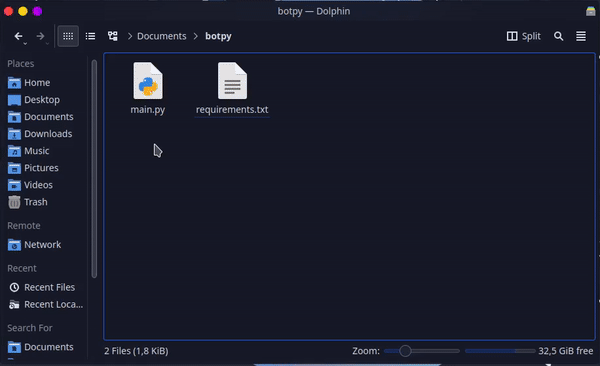

# 🐍 Python

## :file\_folder: Arquivos

Você não deve enviar todos os arquivos de sua aplicação para o `.zip`, existem algumas exceções, elas são:

```diff
- Pasta .git
```

> * Dúvidas para encontrar o seu arquivo principal? [Clique aqui](../../faq/arquivo-principal.md#arquivos-principais-gerais)
> * Dúvidas em criar o seu  arquivo `requirements.txt`? [Clique aqui](criar-requirements.txt.md)


[criar-requirements.txt.md](criar-requirements.txt.md)


## :compression: Compactando os arquivos

Selecione apenas os arquivos necessários, como mencionado em cima e crie o seu **.zip**



Para mais detalhes sobre como **Compactar os seus Arquivos** de acordo com o seu **Sistema Operativo**, pode consultar em baixo:


[zip.md](../../faq/zip.md)


## ✍ Hospedando o seu Bot


Escolha o método para hospedar seu Bot na Discloud:



[via-painel-controle.md](../../hospedar/bots/via-painel-controle.md)



[discord.md](../../hospedar/bots/discord.md)

