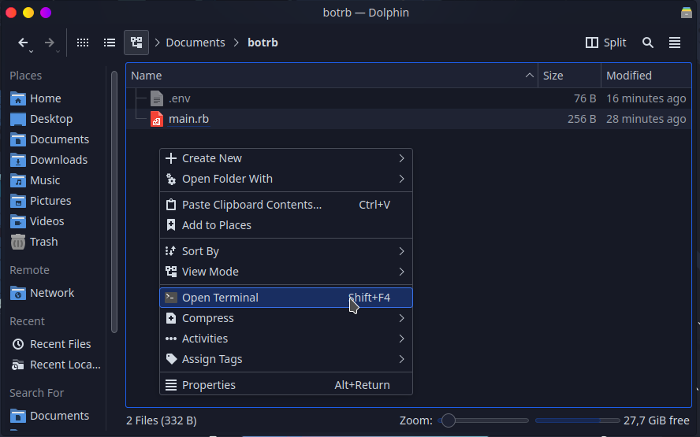
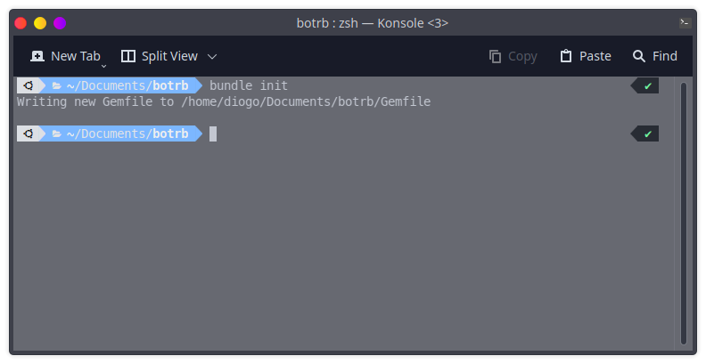
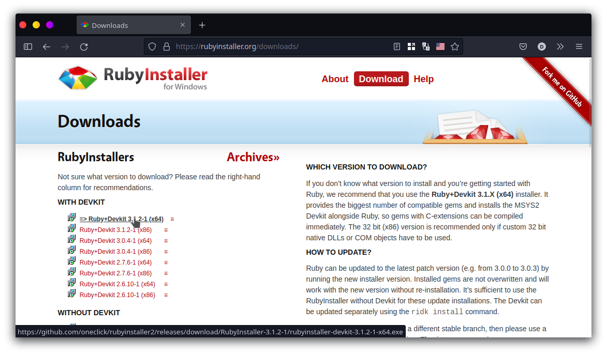
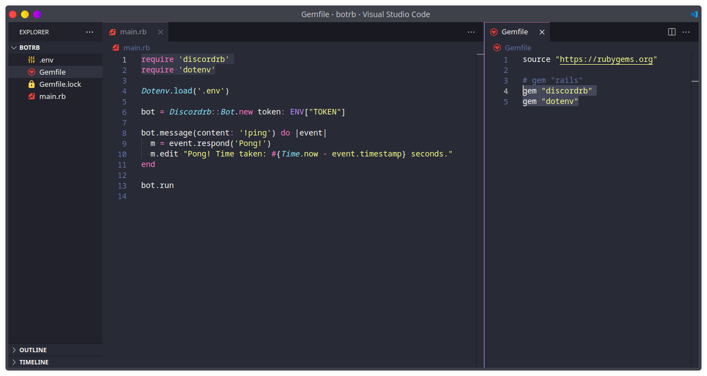

# 📄 Criar o Gemfile

Um arquivo `Gemfile` descreve as dependências **gem** necessárias para executar o seu projeto.

### Como criar o arquivo `Gemfile`?

Abra o Terminal no diretório do seu projeto (Windows use: **Shift+Botão Direito** e clique em **Open PowerShell**) e digite:

```
bundle init
```

 


Você precisa do **Ruby** instalado no seu computador, caso não esteja instalado siga as instruções abaixo.


### Instale o Ruby no seu computador

> **Rubygems** - É um gerenciador de pacotes para módulos Ruby (chamados de gems)
>
> **Bundler** - Permite especificar de quais gems seu projeto depende

> Selecione o seu Sistema Operacional



### Instalação do `Ruby`

### [Baixe o Ruby Aqui](https://rubyinstaller.org/downloads/)



### Verifique a Instalação do `Ruby`

Abra o **cmd** ou **PowerShell** e digite**:**

```
ruby -v
```

### Verifique a Instalação do `Rubygems`

Abra o **cmd** ou **PowerShell** e digite:

```
gem -v
```


Se retornar a versão de ambos então está instalado corretamente!


### Instalação do `bundler`

Abra o **cmd** ou **PowerShell** e digite:

```
gem install bundler
```



### Instalação do `Ruby`

###  Ubuntu

Se você usa **Ubuntu** ou alguma distro baseada, digite o seguinte comando no Terminal:

```
sudo apt install ruby-dev
```

Informações dos pacotes dos Repositórios: [ruby](https://packages.ubuntu.com/search?suite=all\&section=all\&arch=any\&keywords=ruby-dev\&searchon=names)

###  Fedora

Se você utiliza **Fedora** digite o seguinte comando no Terminal

```
sudo dnf install ruby-devel
```

Informações dos pacotes dos Repositórios: [ruby](https://packages.fedoraproject.org/pkgs/ruby/ruby-devel/)

###  Arch Linux

Se você utiliza **Arch Linux** ou alguma distro baseada, digite o seguinte comando no Terminal:

```
sudo pacman -S ruby rubygems
```

Informações dos pacotes dos Repositórios: [ruby](https://archlinux.org/packages/community/x86\_64/ruby/), [rubygems](https://archlinux.org/packages/community/any/rubygems/)

### Verifique a Instalação do `Ruby`

Digite no Terminal o seguinte comando.

```
ruby -v
```

### Verifique a Instalação do `Rubygems`

Digite no Terminal o seguinte comando.

```
gem -v
```


Se retornar a versão de ambos então está instalado corretamente!


### Instalação do `bundler`

Digite no Terminal o seguinte comando.

```
sudo gem install bundler
```



### Colocando dependências no seu `Gemfile`



### [discordrb](https://rubygems.org/gems/discordrb) (rubygems)

Adicione a seguinte linha no seu `Gemfile`


```ruby
gem "discordrb"
```


### [discordrb](https://github.com/shardlab/discordrb) (github)


Se você quiser executar a versão mais recente do **`discordrb`**, fornece funcionalidades mais recentes, mas pode apresentar instabilidades.



```ruby
gem 'discordrb', github: 'shardlab/discordrb', branch: 'main'
```

