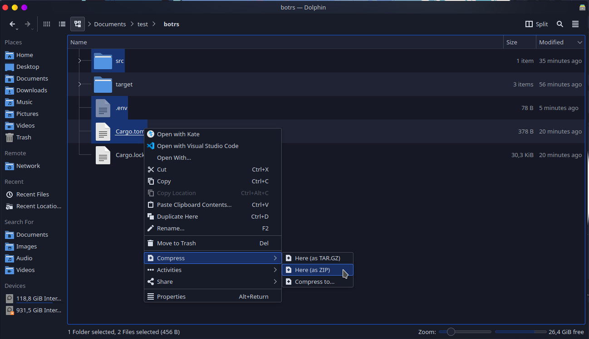

# 🦀 Rust

## :file\_folder: Arquivos

```diff
Arquivos Mínimos Necessários
+ Arquivo Cargo.toml
+ Pasta src
+ Arquivo rust-toolchain.toml ou rust-toolchain (se existir)
+ Outros (Se o seu projeto depender de outros arquivos ou pastas deve incluir)
Arquivos desnecessários:
- Arquivo Cargo.lock
- Pasta target
- Pasta .git
```


[criar-package.json.md](criar-package.json.md)


## :compression: Compactando os arquivos



Para mais detalhes sobre como **Compactar os seus Arquivos** de acordo com o seu **Sistema Operativo**, pode consultar em baixo:


[zip.md](../../faq/zip.md)


## ✍ Hospedando o seu bot


Escolha o método para hospedar seu Bot na Discloud:



[via-painel-controle.md](../../hospedar/sites/via-painel-controle.md)



[discord.md](../../hospedar/bots/discord.md)


## :earth\_americas: Hospedando o Seu Site


Esta funcionalidade necessita de alguns requisitos básicos para poder ser utilizada, por favor consulte os requisitos [aqui](../../hospedar/sites/#requisitos) antes de continuar


### Utilizando o `Rocket`

**Rocket** é um framework web feito em rust, atualmente funciona apenas na versão nightly do rust

```shell
rustup override set nightly
```

### Instalando o `Rocket`

Consulte a documentação oficial: [https://rocket.rs/](https://rocket.rs/)

### Configurando `Rocket` para a DisCloud

Crie um arquivo `rust-toolchain.toml`:


```toml
[toolchain]
channel = "nightly"
```


Isso irá instruir o `rustup` a usar a versão `nightly`, e baixar essa versão caso seja necessário.

#### Exemplo `discloud.config` para `Rocket`


```typescript
ID=subdomino
TYPE=site
MAIN=src/main.rs
RAM=512
AUTORESTART=false
VERSION=latest
APT=tools
```

